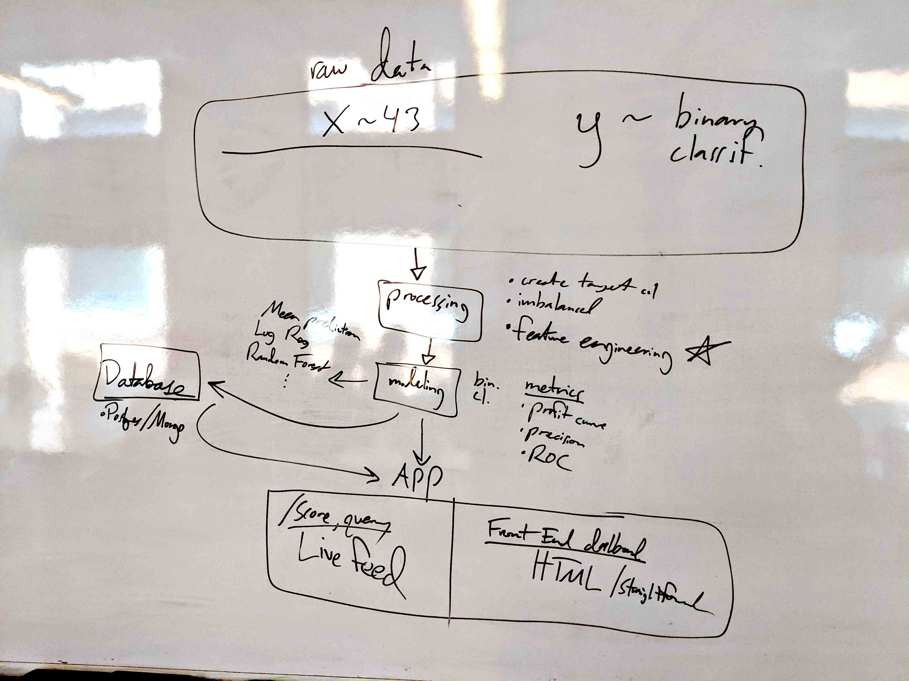
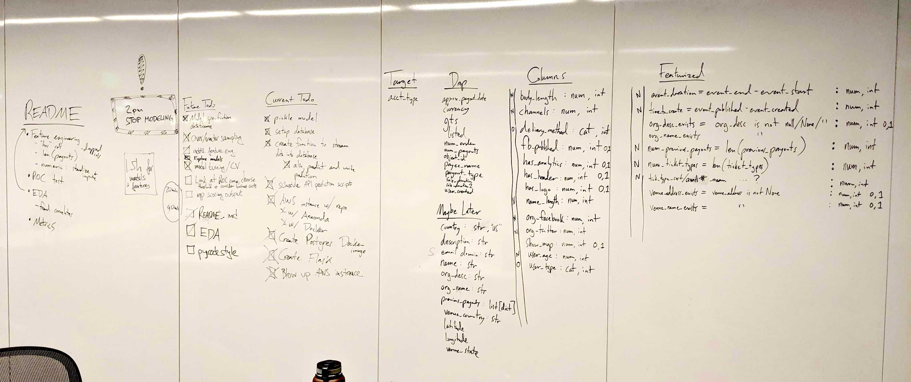
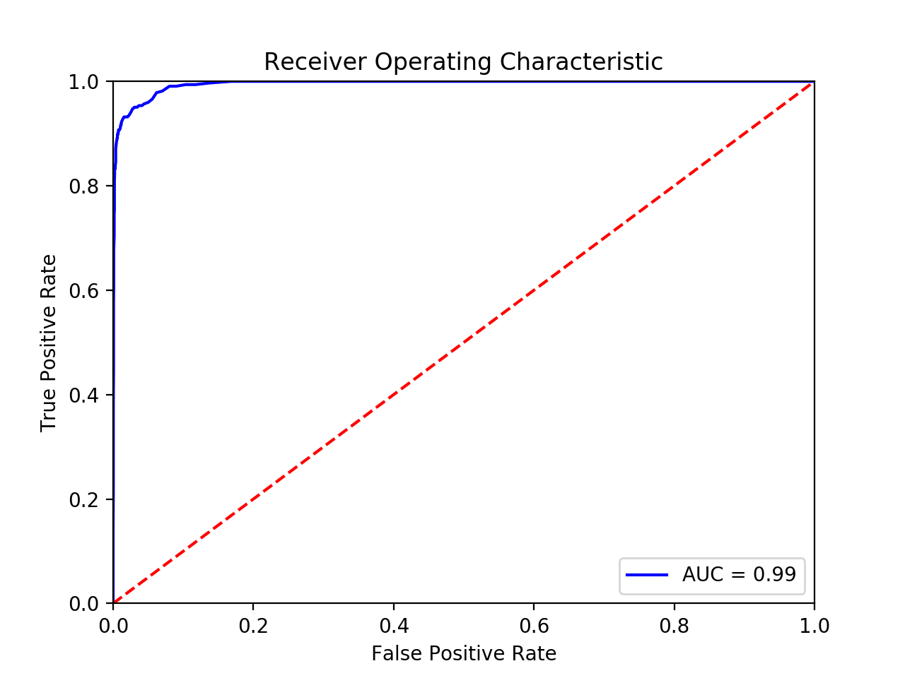

# Real-Time E-Commerce Fraud Screening

## Goals
Our goal is to create a sustainable, cloud-based software project to flag potential fraudulent events posted to the company software platform in real-time.

We were given access to a data set consisting of ~14,000 events which were already classified as being legitimate or fraudulent. There were ~13,000 legitimate and ~1,300 fraudulent events.

## Process Flow
We placed a heavy emphasis on mapping out this project and planning out our next steps every few hours. Whiteboards are our friends.

Instead of splitting up this project and working on sections individually, we mostly employed a 3-way group programming approach. We alternated projecting one of our screens on a TV and worked together to solve issues. We found that we all learned new things while working this way, and we were able to quickly resolve issues using our collective knowledge. When appropriate, we also split up and worked individually on sections of the project, while checking in frequently.

## Data Preprocessing
### Restricting Available Data
Our initial data set contained a number of pieces of information that would not generally be know at the time of creation of an event, so we removed them. These included:
  * Info pertaining to payouts for the event in question.
  * Ticket sales info.
  * Payee info.
  * Time-based info that would not be available when the event was created.

### Exploratory Data Analysis
We made used of several helper functions that we created while initially exploring the data. Our initial focus was on finding easy predictors for our model, which included:
  * Features that were binary encoded (e.g. "has_logo").
  * Numeric features, which we normalized (e.g. "body_length").
  * Easily extracted numerical features (e.g. number of "previous_payouts").

## Modeling
### Model Accuracy Metrics
Our model accuracy metrics were chosen with the intended purpose of this tool in mind, which is to flag events that are **potentially** positive for fraud, so they can then be reviewed by an actual human being.

  * As such, our goal was to minimize both false positive and false negative results, so an F1 score was our target.
  * We also considered recall as a target score, because review by a human will limit the impact of events falsely flagged as fraudulent.

### Validation And Testing Methodology
In order to be as thorough as possible, we performed a stratified split of our data at the very beginning, in order to have a holdout data set for final model accuracy testing.

While selecting and tuning our models, we employed a GridSearchCV strategy, which varies specified model parameters while performing cross-validation using our testing data.

### Results

| Metric | Score |
| --- | --- |
| classification_threshold | 0.5 |
| cv_accuracy | 0.981589 |
| cv_precision | 0.953983 |
| cv_recall | 0.835865 |
| cv_roc_auc | 0.986365 |
| cv_f1 | 0.890859 |

## App Link: http://bit.ly/fraud_predictor

## Future Steps
While we are satisfied with the progress we've made so far, given additional funding for this project, our future goals would include the following:
  * Additional feature engineering, including Natural Language Processing of free-form predictor information.
  * Additional model types and tuning.